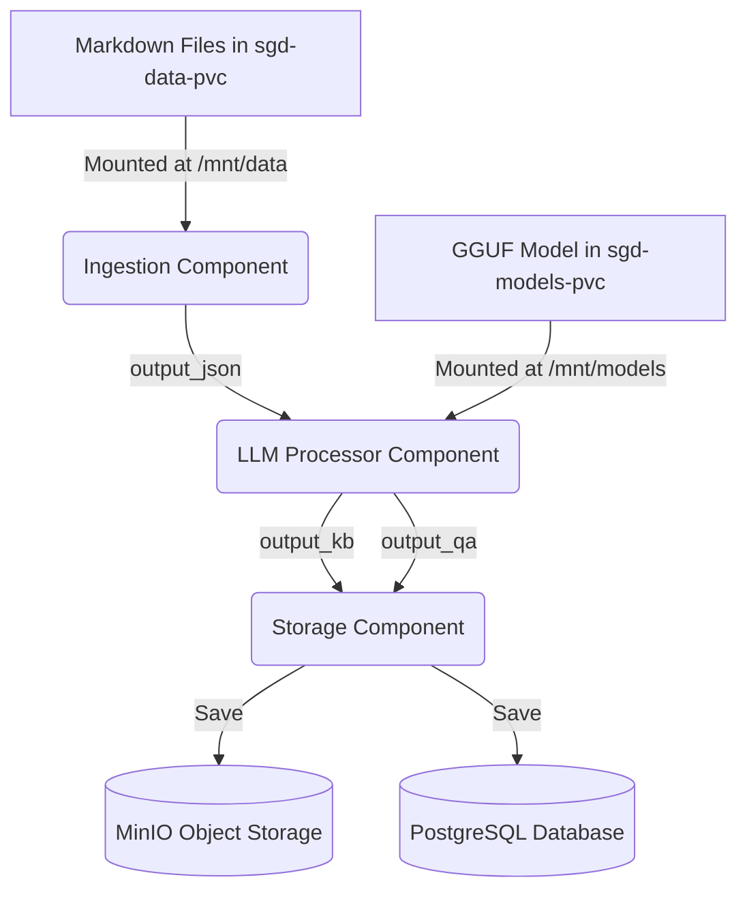

# INFO: SGD-Mini Pipeline Flow

This document provides a technical overview of the end-to-end data flow and architectural design of the `sgd-mini` Kubeflow pipeline.

## 1. Architectural Overview

The pipeline is designed as a modular sequence of containerized components orchestrated by Kubeflow Pipelines (KFP). It transforms raw markdown documentation into a structured knowledge base and extracted Question-Answer pairs.

## 2. Component-by-Component Flow

### Stage 1: Ingestion (`ingestion_op`)
- **Input**: Absolute path to a directory containing `.md` files (mounted via `sgd-data-pvc`).
- **Process**: 
    - Recursively scans the directory for markdown files.
    - Reads the text content and creates a structured list of dictionaries containing `filename` and `content`.
- **Output**: A JSON file containing the aggregated document data.

### Stage 2: LLM Processing (`llm_processor_op`)
- **Inputs**: 
    - `input_json`: The output from the ingestion stage.
    - `model_path`: Path to a GGUF model (e.g., `LFM2.5-1.2B-Instruct-Q8_0.gguf`) mounted via `sgd-models-pvc`.
- **Process**:
    - **Knowledge Base Generation**: Uses the LLM to generate a long-form, detailed summary for every source document. It focuses on technical depth and comprehensive coverage.
    - **QA Extraction**: Uses the LLM to extract 3-5 structured Question-Answer pairs in JSON format.
- **Outputs**:
    - `output_kb`: A text-based Knowledge Base containing extensive summaries.
    - `output_qa`: A JSON Dataset containing the extracted QAs.

### Stage 3: Storage (`storage_op`)
- **Inputs**:
    - `kb_file`: The detailed Knowledge Base text.
    - `qa_file`: The extracted QA JSON.
- **Process**:
    - **MinIO**: Uploads the Knowledge Base as a `.txt` file and QAs as a `.json` file to the specified buckets.
    - **PostgreSQL**: Connects to a database, ensures schema existence (`knowledge_base` and `qas` tables), and performs batch insertion of the summarized text and QA pairs.
- **Output**: Confirmation logs of successful data persistence.

## 3. Data Infrastructure & Mounting

The pipeline relies on two primary Kubernetes Persistent Volume Claims (PVCs):

| PVC Name | Mount Path | Purpose |
|----------|------------|---------|
| `sgd-data-pvc` | `/mnt/data` | Stores the source `.md` files to be processed. |
| `sgd-models-pvc` | `/mnt/models` | Stores the LLM GGUF models (e.g., Llama-cpp compatible). |

### 4. Database Services

The pipeline integrates with the following services for data persistence:

| Service Name | Port | Namespace | Purpose |
|--------------|------|-----------|---------|
| `minio-service` | 9000 | `kubeflow` | Stores `.txt` summaries and `.json` QA pairs. |
| `postgres-service` | 5432 | `kubeflow` | Stores structured knowledge and QAs in SQL tables. |

## 5. Execution Workflow

1.  **Preparation**: Ensure MD files are in the data directory and the GGUF model is in the models directory on the host machine (mapped to the PVs).
2.  **Compilation**: Run `python pipeline/compiler.py` to generate the YAML spec.
3.  **Deployment**: Upload the YAML to Kubeflow and trigger a run.
4.  **Observation**: Monitor the logs for LLM generation progress and storage confirmation.
